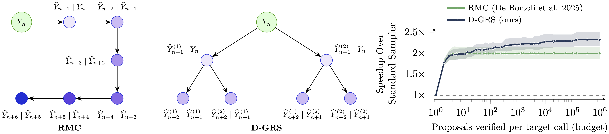

# Accelerating Diffusion Sampling via Speculative Draft Trees 
[](https://arxiv.org/abs/2609.17691)

[](https://scholar.google.com/citations?user=k0a9iN8AAAAJ&hl=it&oi=sra)
[](https://scholar.google.com/citations?user=M6u1tgUAAAAJ&hl=it&oi=sra)
[](https://github.com/oykusilaguner)
[](https://scholar.google.com/citations?user=jAS9pzQAAAAJ&hl=it&oi=sra)
[](https://scholar.google.com/citations?user=MbmKROkAAAAJ&hl=it&oi=ao)

<p align="center">
  
</p>

Algorithm 1 of *Accelerating Diffusion Sampling via Speculative Draft Trees*: speculative
diffusion sampling over an arbitrary draft tree, with a pluggable verification rule.

The implementation follows the paper's central abstraction: RMC and D-GRS differ in the
*draft topology* and the *verification rule*. Applications provide those components, while
the sampler remains independent of their implementation.

```python
from specdiff import DraftTree, DelayedDriftProposal, SpeculativeSampler

sampler = SpeculativeSampler(
    target=my_target,                           # m^q  (the expensive network)
    proposal=DelayedDriftProposal(my_target),   # m^p  (eq. 7)
    schedule=my_schedule,                       # {sigma_n}
    tree=DraftTree.uniform(branching=4, lookahead=3),
    verifier=my_rule,                           # Verify
    num_steps=100,
    check_contract=True,                        # while developing a rule
)
result = sampler.sample(y0, rng=rng)
print(result.summary())   # speedup, NFEs, acceptance rate, batch volume
```

Set `proposal_refinement_iters=J` to run up to `J` target-backed Picard iterations after
the initial draft and before verification. Sweeps freeze only the target's drift by
default (`picard_drift_update_fn`); `picard_update_fn` freezes the whole increment
and matches the reference ParaDiGMS recurrence on a chain with matching inputs.
Neither update universally dominates the other. The sweep count is capped at the
actual lookahead each round (the longest active lookahead for batched sampling).
Use `refinement_update_fn=picard_jtx_update_fn` for JTX, which transports the
target-minus-base-proposal error to the rebuilt parent. For a limited-memory
secant correction, use `picard_broyden_correction_update_fn` (default: at most two
rank-one factors per parent; history resets each round). See
[Proposal refinement](docs/refinement.md) for the derivations: recurrence, conditional
Gaussian law, finite-depth convergence, mismatch and error propagation, and target-mean reuse.

## Installation

Create a Python environment:
```bash
conda create -n specdiff python=3.12 && conda activate specdiff
```
Install from the repository root. Here, `.` refers to the project rather than the
`specdiff/` package directory:
```bash
pip install -e '.[dev]'
```
Run the test suite:
```bash
python -m pytest tests -q
```
Optional extras. For the PyTorch backend:
```bash
pip install -e '.[torch]'
```
To install all optional dependencies, including tests, plotting, and image experiments:
```bash
pip install -e '.[all]'
```

The EDM image experiments also require the source modules from `NVlabs/edm`.
After installing either the `edm` or `all` extra, download the tested revision
into this checkout's `edm/` directory:

```bash
pip install -e '.[edm]' && specdiff-download-edm
# Or install every optional dependency:
pip install -e '.[all]' && specdiff-download-edm
```

The upstream repository is not an installable Python package, so pip cannot
resolve it as an optional dependency. The downloader is idempotent and reuses
an existing valid `edm/` checkout.

| extra | |
| --- | --- |
| `dev` | tests, plus the plotting stack — enough for the whole GM experiment |
| `plots` | `matplotlib`, `pandas`, `seaborn` — plotting only |
| `edm` | dependencies and checkout command for pretrained EDM experiments and multi-GPU sharding |
| `all` | everything above |

The core library requires SciPy (including NumPy) for PAWS rank optimization and residual
CDF inversion. NumPy is available by default; install `[torch]` for PyTorch states. On CUDA systems, install PyTorch from the appropriate PyTorch index
before installing this package if a specific CUDA build is required; otherwise, `pip` uses
the standard PyPI wheel.

## Notation

The code and documentation use the following notation consistently:

| symbol | in code | meaning |
| --- | --- | --- |
| `N` | `num_steps` | denoising steps in the full trajectory — the standard sampler's NFE count |
| `L` | `lookahead`, `tree.depth` | levels of the draft tree below the root; how far ahead one round speculates |
| `J` | `proposal_refinement_iters` | synchronous proposal-refinement sweeps within each round |
| `K` | `branching`, `tree.branching` | candidate children per node. `K = 1` is RMC's chain |
| `B` | `tree.budget` | states **drafted** per round, `K + ... + K^L` (eq. 12) — the *proposal* budget the paper plots against |
| `\|I\|` | `tree.verification_budget()` | states the **target** evaluates per round, `B / K` when uniform — the *verification* budget, and the batch that must fit in memory |
| `n` | `step`, `start_step` | index of the current step along the trajectory, `0 <= n < N` |
| `sigma_n` | `schedule(step)` | noise scale, shared by proposal and target at step `n` |
| `delta` | `Rank1Frame.delta` | normalised mean mismatch `\|\|mu_q - mu_p\|\| / sigma`; sets every acceptance probability |
| — | `batch`, `batch_size` | independent trajectories (images) sampled at once. Not in the paper; see [Batching over images](#batching-over-images) |

Array shapes are written `(batch, K, *state_shape)`, where `state_shape` is whatever a single
diffusion state is for your model — `(d,)`, `(3, 32, 32)`, `(16, 64, 64)` for an SD3 latent.

## Layout

```
pyproject.toml
specdiff/
  sampler.py  batched.py  refinement.py  trees.py  kernels.py  verify.py  types.py  testing.py  ops.py
  verifiers/
    rank1.py  rmc.py  dgrs.py  paws.py
tests/       test_sampler.py  test_batched.py  test_rank1.py  test_rmc.py  test_dgrs.py
             test_torch_backend.py
examples/    gaussian_mixture.py
```

| module | responsibility |
| --- | --- |
| `specdiff/sampler.py` | Algorithm 3: drafting, verification, acceptance, NFE accounting |
| `specdiff/batched.py` | the same, over many trajectories per target call |
| `specdiff/trees.py` | draft topologies, layers, internal nodes, truncation `T|_m` |
| `specdiff/kernels.py` | `TargetTransition`, `ProposalTransition`, noise schedules, delayed drift |
| `specdiff/refinement.py` | row-local refinement contract, tree scan, fixed-noise updates (drift, increment, JTX, Broyden), exact target cache |
| `specdiff/verify.py` | the `Verifier` contract, contract checker, name registry |
| `specdiff/types.py` | `VerifyRequest`/`VerifyResult` and the run records |
| `specdiff/verifiers/rank1.py` | the rank-1 reduction (eqs. 8–11), shared by any isotropic rule |
| `specdiff/verifiers/rmc.py` | Algorithm 1: reflection maximal coupling (`rmc`), `K = 1` |
| `specdiff/verifiers/dgrs.py` | Algorithm 2: greedy rejection sampling (`d-grs`), any `K` |
| `specdiff/verifiers/paws.py` | PAWS rank-selection list coupling (`paws`), any `K` |
| `specdiff/testing.py` | statistical exactness test for a rule |
| `specdiff/ops.py` | array-backend operations; PAWS additionally uses NumPy/SciPy for scalar numerics |

```bash
pip install -e '.[dev]' && python -m pytest tests -q
```

States must use a floating-point dtype. Integer arrays truncate Gaussian draws and invalidate
the trajectory, so `sample()` rejects them. Both `float32` and `float64` are supported.

## Documentation

| | |
| --- | --- |
| [docs/writing-a-verifier.md](docs/writing-a-verifier.md) | verifier contract, rank-1 coordinates, exactness testing, and implementation guidance |
| [docs/paws.md](docs/paws.md) | PAWS derivation, rank/complement variants, numerical correction, and experiments |
| [docs/refinement.md](docs/refinement.md) | tree Picard derivation, callback invariants, exact target-mean reuse, and accounting |
| [docs/models.md](docs/models.md) | plugging in your own diffusion model, proposals, trees, backends |
| [docs/architecture.md](docs/architecture.md) | how a round works, data flow, cost accounting, design decisions |
| [docs/api-reference.md](docs/api-reference.md) | every exported symbol |
| [notebooks/](notebooks/README.md) | one runnable tutorial per component — trees, kernels, verifiers, the two samplers, backends, and an end-to-end walkthrough |

`examples/gaussian_mixture.py` provides an end-to-end example using a Gaussian mixture and
requires no neural network.

## Verifier contract

```python
class MyRule(Verifier):
    max_children = None            # or 1 for a single-proposal coupling

    def verify(self, request: VerifyRequest) -> VerifyResult:
        ...
```

`VerifyRequest` gives you `proposal_mean`, `target_mean`, `sigma`, and `children`
(shape `(K, *state_shape)`, **in drafting order**). You return a state, whether it was
accepted, and the selected child index. The same rule works with both scalar and batched
samplers.

Three obligations:

1. `state` is an exact sample from `N(target_mean, sigma^2 I)`.
2. If `accepted`, `state` *is* `children[child_index]` — not a copy-with-correction. The
   sampler descends into that child's subtree, so a mismatch invalidates the trajectory.
3. Children are examined in the order given, if your rule is a sequence coupling.

Obligation 2 is enforced by `check_contract=True`. Obligation 1 cannot be checked per call,
so test it:

```python
from specdiff import check_exactness
report = check_exactness(MyRule(), delta=1.5, num_children=4, seed=0)
assert report.passed, report
```

This projects the returned state onto the displacement direction, where exactness implies
`N(delta, 1)` regardless of the rule's internal implementation, and runs a KS test. It detects
coupling errors that can otherwise produce samples from the wrong distribution.

`seed` controls every draw — the direction, the children, and whatever your rule consumes
via `request.rng` — so a report is reproducible. Keep it: this is a hypothesis test at level
`alpha`, so a *correct* rule fails it about `alpha` of the time, and an irreproducible
failure is indistinguishable from a real coupling bug.

### Working in rank-1 coordinates

`Rank1Frame.from_request(request)` gives you `delta`, the unit `direction`, and
`project`/`reconstruct`. Check `frame.degenerate` before dividing by `delta`:

```python
frame = Rank1Frame.from_request(request)
if frame.degenerate:                    # delta is zero to working precision
    return VerifyResult(request.child(0), accepted=True, child_index=0)
tau = frame.tau(lam)                    # ln(lam) / delta, guarded
```

`degenerate` is `delta <= tol`, not `delta == 0`, with `tol = 1e-10` — a constant, and
deliberately *not* dtype-derived: `delta`, `tau` and the D-GRS masses are Python floats
computed in float64 whatever the states carry. Exact equality is the wrong test: the regime that
breaks a rule is small-and-nonzero `delta`, which is what a *good* proposal produces, and
there `ln(lambda) / delta` saturates `Phi_bar` to exactly 0 and makes the D-GRS residual mass
vanish. Below `tol` the kernels are indistinguishable at the state's own precision, so
accepting unconditionally is the correct limit rather than an approximation.

## Batching over images

Unlike a standard sampler, speculative trajectories may accept prefixes of different lengths
and therefore advance asynchronously. `batched.py` preserves the same round structure while
tracking a separate step `n_i` for each trajectory. A single target call serves all active
trajectories.

```python
from specdiff import BatchedSpeculativeSampler, DelayedDriftProposal

sampler = BatchedSpeculativeSampler(
    target=my_target,
    proposal=DelayedDriftProposal(my_target),   # one frozen drift per trajectory
    schedule=my_schedule,
    tree=DraftTree.uniform(branching=4, lookahead=3),
    verifier=my_rule,                                  # unchanged
    num_steps=100,
    keep_trajectories=False,                           # only the terminal states
)
result = sampler.sample(y0_batch)      # (batch, *state_shape)
print(result.summary())
```

Three things the batch dimension actually changes:

**`sigma` is per row.** `BatchedVerifyRequest` carries `sigmas`, a tuple, because rows of one
verification batch belong to different steps. Use `ops.scale_rows` to broadcast it portably.

**Live rows shrink as the round descends.** A trajectory that rejects at level 1 takes no
part in level 2. The sampler compacts rather than masks, so a rule never sees a dead row and
never needs a validity flag. `request.indices_in_batch[j]` says which image row `j` is, for
rules holding per-image state; `request.row(j)` carries it through as `index_in_batch`.

**Cost is a max, not a mean.** One call serves every live trajectory, so the batch advances
at the pace of its slowest member. `result.speedup` (`N / iterations`) is the wall-clock
number; `result.mean_isolated_speedup` is what those trajectories would each have achieved
alone, and `result.occupancy` is how full the batch stayed. The gap is real and is what you
tune batch size against — the worked example prints ~12% for a batch of 16 at `L=3, alpha=0.84`.
`result.acceptance_rate` is pooled over every trajectory and round, so it is directly
comparable with the single-trajectory result for the same configuration.

Two requirements the batched path adds. The tree must be **level-uniform** (every node at a
given depth has the same width) so that a level's candidates form a rectangular
`(batch, K, *shape)` array — `uniform` and `from_widths` qualify, arbitrary pruned trees do not.
The proposal needs no change at all: `ProposalTransition` takes `indices_in_batch` at every
batch size, so the object you hand the single-trajectory sampler is the object you hand this
one. `DelayedDriftProposal` keeps a `(batch, *shape)` buffer of increments indexed by
`indices_in_batch`, so no trajectory can pick up another's drift, and its warm-ups go in a
single batched call.

Rules get `verify_batch`, whose default implementation loops over rows calling `verify`, so
nothing needs rewriting. Override it when the per-node work is worth vectorising — for the
paper's rules, the sweep over levels `lambda_k` becomes an `(batch,)` vector operation and the
`d`-dimensional projections become single batched ops. An override must stay row-independent:
row `j` may depend only on `request.row(j)`.

`info` carries the same keys either way, with one translation: rows sit at different tree
nodes, so the batched request holds `info["nodes"]` (a tuple) while `request.row(j)` turns it
back into the scalar contract's `info["node"]`. A rule keyed on `info["node"]` therefore runs
unchanged under both samplers.

`check_contract=True` applies identical per-row checks on both paths — shape, finiteness,
index bounds, and accepted-state identity — so a rule the scalar sampler rejects is rejected
under batching too, with the same message plus a row number.

Trajectories share an RNG stream, so a given trajectory is not bit-reproducible across
different batch sizes. Its law is unaffected.

## Design notes

**Why the tree is a first-class object.** Because "the chain is just `K = 1`" is only true if
chain and tree share a representation. They do: a `DraftTree` is a general rooted tree in BFS
order, `DraftTree.chain(L)` is a valid one, and depth-dependent widths (`from_widths`) or
pruned trees need no new code path. Node ids in BFS order also make `T|_m` (eq. 27, needed
when `L_n = min(L, N - n) < L` near the horizon) a slice.

**Why `Verify` takes means and a scale, not distributions.** Eq. (24) is an assumption of the
template, not an implementation detail: proposal and target must be isotropic Gaussians
sharing the variance schedule. Encoding it in the request type means a rule may *rely* on it,
which is what makes the rank-1 reduction legal. `NoiseSchedule.__call__` refuses a zero
scale, since at zero churn both kernels are point masses and speculation is vacuous
(Remark 3).

**Why the proposal has lifecycle hooks.** The interesting proposals keep per-image memory. The
delayed reverse drift needs to know when a round starts and which target drifts have become
available; root-drift prefetching then reuses a drift the previous round already paid for
during verification, instead of spending an extra NFE per round. The hooks let that live in
the proposal rather than as a special case in the sampler. What gets frozen is the target's
decision (`freeze_drift` / `apply_drift`, both required): the churn kernels freeze the network
velocity and re-run the step at the drafted node, so the `eps`-dependent score correction
stays exact; sliding the paper's increment `m^q(y) - y` along instead is only right for a
translation-like mean.

**Where the NFEs are counted.** `TargetTransition.__call__` counts; that is why you call the
instance rather than `.means()`. Cost is reported as `target_calls` (the paper's metric: one
batched call per round) and separately as `target_states_evaluated` (batch volume). The target
is evaluated only at *internal* nodes — leaves are never parents, so `|I| = B / K` for a
uniform tree, which is where a tree buys back some of its verification cost.

[](https://github.com/marcellobullo)
