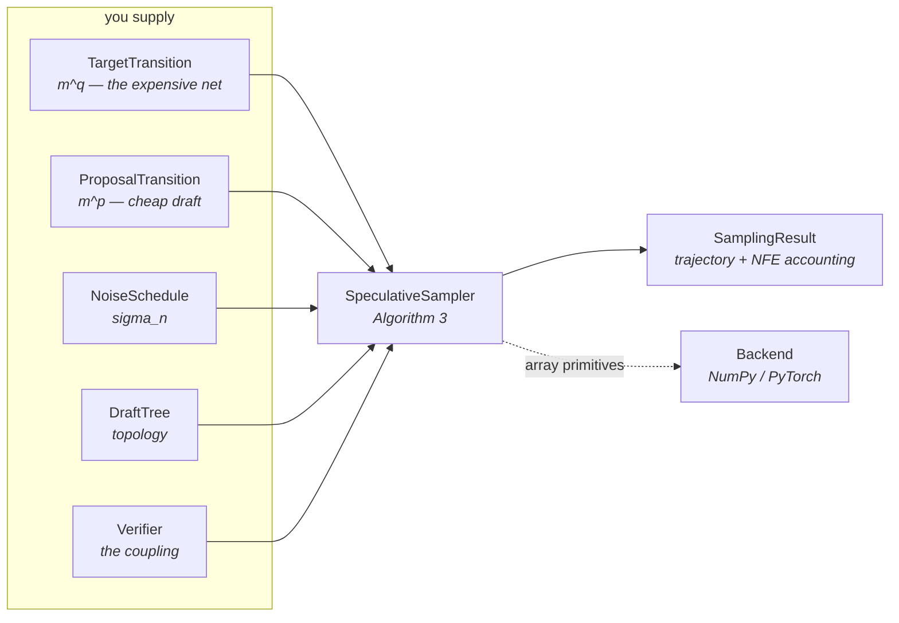
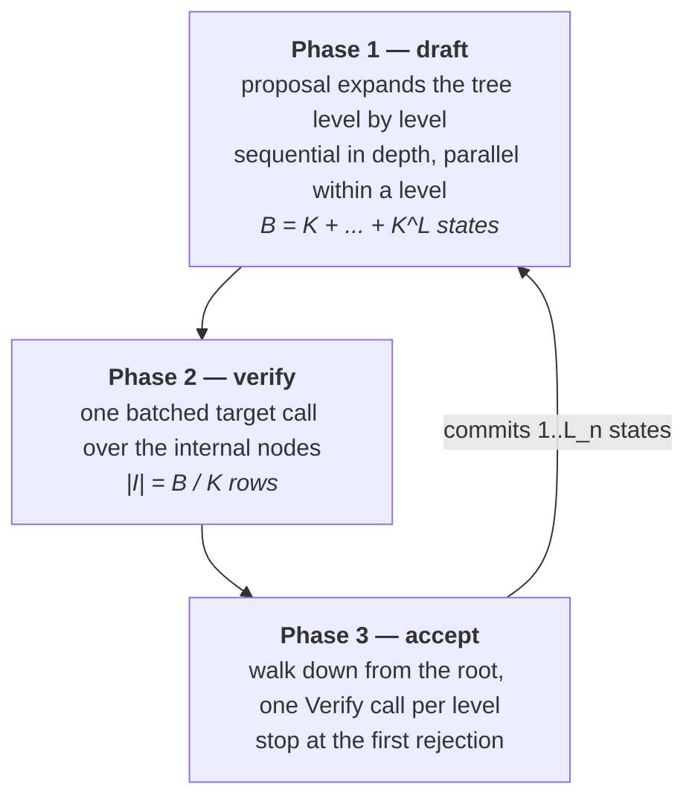
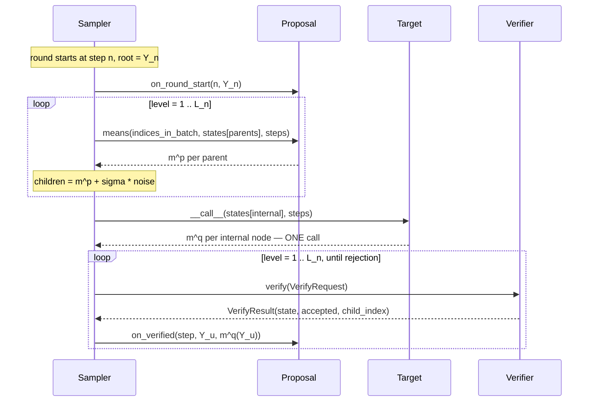

# Architecture

This document describes the sampler's components, data flow, and design boundaries.

Use it when modifying the sampler, adding a component type, or interpreting values in
`result.summary()`. For verifier implementations, see
[writing-a-verifier.md](writing-a-verifier.md).

## Context

A standard diffusion sampler spends one neural function evaluation (NFE) per denoising
step: `N` steps require `N` calls to the expensive network. This cost is difficult to reduce
because step `n + 1` depends on the output of step `n`.

Speculative sampling breaks the dependency the same way speculative decoding does in
language models. A cheap *proposal* drafts several steps ahead; the expensive *target* then
evaluates all drafted states in one batched call; a *verification rule* decides how much of
the draft to retain. Rejected drafts reduce the committed prefix length, while the verifier
preserves the target trajectory distribution.

The design follows the paper's separation between *draft topology* and *verification rule*.
Applications provide both components; the sampler is independent of their implementation.

## The components



The sampler owns the execution loop and accounting. It does not depend on the target model,
tree topology, or verifier internals, so RMC and D-GRS share the same sampling path.

## Modelling assumption: Equation (24)

The request type encodes one required assumption:

```
P_n(. | y) = N(m^p_n(y), sigma_n^2 I)     proposal
Q_n(. | y) = N(m^q_n(y), sigma_n^2 I)     target
```

Both kernels are isotropic Gaussians that **share the variance schedule** and differ only in
their means. `NoiseSchedule` is a single object handed to both, not one per model, so the
assumption is enforced by the interface.

This shared covariance permits the rank-1 reduction from a `d`-dimensional coupling problem
to a scalar problem. See
[writing-a-verifier.md](writing-a-verifier.md#rank-1-coordinates).

`NoiseSchedule.__call__` refuses a zero or negative scale: at zero churn both kernels are
point masses, their total-variation distance is 1, and speculation provides no benefit
(Remark 3).

## One round, in three phases

A round starts at step `n` with the committed state `Y_n` at the root of the tree, and ends
having committed between 1 and `L_n` new states, where `L_n = min(L, N - n)`.



**Phase 1 is sequential in depth and parallel within a level.** A child cannot be drawn
before its parent exists, so the levels are ordered; but every node at a given level is
expanded in one proposal call. Every sibling is expanded, because which one survives is not
decided until Phase 3.

With positive `proposal_refinement_iters`, Phase 1 continues with synchronous tree Picard
sweeps. Each sweep evaluates one row-local increment for every internal node, then rebuilds
the tree breadth-first with the original fixed edge innovations. See
[Proposal refinement](refinement.md).

**With refinement disabled, Phase 2 makes one target call over internal nodes.** With
refinement enabled, exact target means from the final sweep are reused wherever the final
state is exactly unchanged; all remaining internal nodes share at most one final call.
Leaves are not parents unless `evaluate_leaves` requests them for prefetching.

**Phase 3 descends and stops at the first rejection.** At each level the rule sees one
parent and its `K` drafted children, and returns a state that is an exact draw from
`N(m^q, sigma^2 I)`. If it accepted, the returned state *is* one of the children and the
walk descends into that child's subtree. If it rejected, the round ends there. Either way
one state is committed per level examined, so a round that rejects at level 1 still makes
one state is committed for every level examined, ensuring that the loop terminates.

### Step indexing

One convention, used identically in all three phases: **a node `u` at depth `d` within a
round starting at step `n` is associated with step `n + d`.** Its children realise step
`n + d + 1` and are drawn with scale `sigma_{n+d}`.

The deepest node the target is ever evaluated at has depth `L_n - 1`, so the largest step
index reaching the schedule is `n + L_n - 1 <= N - 1`. A `TabulatedSchedule` therefore needs
`N` entries.

### Horizon truncation

Near the end of the trajectory a full-depth tree would overshoot. Eq. (27)'s truncation
`T|_m` handles it. Breadth-first node IDs make nodes at depth `<= m` a contiguous prefix
`0 .. offset[m+1]`, so truncation uses a cached slice instead of rebuilding the tree.

The two samplers reach the same node set by different routes: the scalar one truncates the
tree, the batched one filters levels by each row's own lookahead. They agree, and
`tests/test_batched.py` verifies that both paths produce bit-identical trajectories.

## Data flow through a round

Trajectory state lives in flat stacks of shape `(num_nodes, *state_shape)`, indexed by node
id. The batched sampler uses the same layout with rows laid out as `row * tree.size + node`,
so the backend needs no gather beyond the row indexing it already has.



`on_verified` supports **root-drift prefetching**. The delayed-drift proposal caches the drift
behind a target mean already computed in Phase 2 (`target.freeze_drift`: the network
velocity for the churn kernels) and reuses it in the next round. The hook runs after either
acceptance or rejection because the target evaluation is available in both cases. This design
requires one initial warm-up call at `n = 0`, which is included in `target_calls`.

## Cost accounting

`TargetTransition.__call__` — not `means` — keeps the counters, which is why subclasses
override `means` and callers invoke the instance:

| field | meaning |
| --- | --- |
| `target_calls` | batched target calls: proposal-owned, refinement, and final verification NFEs |
| `target_states_evaluated` | total rows pushed through the target — batch volume, not NFEs |
| `drafted_states` | states the proposal produced, `sum of B_n` |

`speedup = num_steps / target_calls`. The denominator includes any warm-up call a proposal
needed. `standard_sampler` therefore reports `1.00x`, while a verifier that rejects every
draft reports slightly below `1.00x` when the proposal requires a warm-up.

## The batched sampler

Image batching is independent of within-round parallelism. It requires explicit scheduling
because trajectories can accept prefixes of different lengths and advance to different
steps. After one round, for example, trajectory 0 may be at step 4 while trajectory 1 is at
step 1.

This behavior determines the design of `batched.py`:

1. **`sigma` becomes per row.** Rows of one verification batch belong to different steps, so
   `BatchedVerifyRequest` carries `sigmas`, a tuple.
2. **Live rows shrink as the round descends.** The sampler *compacts* rather than masks: each
   each level's request contains only active rows, so verifiers do not require validity masks.
3. **Cost is a max, not a mean.** One target call serves every live trajectory, so the batch
   advances at the pace of its slowest member. `speedup` (`N / iterations`) is strictly below
   `mean_isolated_speedup`; the difference measures straggler overhead and informs batch-size
   selection.

The batched path adds two requirements: the tree must be **level-uniform** (so a level's
candidates form a rectangular `(batch, K, *shape)` array). The proposal needs no change —
`ProposalTransition` is the same interface at every batch size. Verification rules need no
change either: `verify_batch` defaults to a row-wise loop over the `verify` you already wrote.

## Key decisions

**The tree is a first-class object.** Chains and branching trees share one representation:
a `DraftTree` is a general rooted tree in BFS order,
`chain(L)` is a valid one, and depth-dependent widths (`from_widths`) or pruned trees need
no new code path. Appendix C's observation is what licenses this — the reverse chain is
Markov, so each drafted state is drawn conditionally on exactly one parent, so *any* draft
set is a rooted tree.

**`Verify` takes means and a scale, not distributions.** Eq. (24) is an assumption of the
template, not an implementation detail. Encoding it in the request type means a rule may
*rely* on it, which is what makes the rank-1 reduction legal.

**Topology constraints are checked at construction.** A rule that can only couple one
proposal sets `max_children = 1`, and the sampler rejects an incompatible branching tree
during construction.

**One module touches the array framework.** `ops.py` is the entire dependency surface;
porting to JAX or MLX requires one `Backend` subclass. See
[models.md](models.md#adding-a-backend).

## Operational constraints

**The single-trajectory sampler is the reference implementation.** It prioritizes clarity and
provides the baseline used to test `BatchedSpeculativeSampler`, which is intended for
production generation workloads.

**Drafting cost is assumed negligible.** The paper's cost metric counts target calls only.
If your proposal is a distilled network rather than a frozen drift, `B` proposal
evaluations per round add measurable cost, and `speedup` may overstate wall-clock performance.
Use `drafted_states` to account for proposal cost.

**Exactness cannot be established from a single runtime call.** A verifier may return samples
from the wrong distribution without triggering a runtime error. Use `check_exactness` to test
the verifier statistically before deployment.
