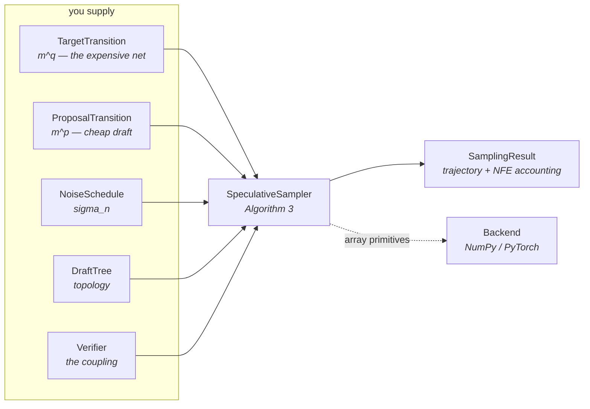
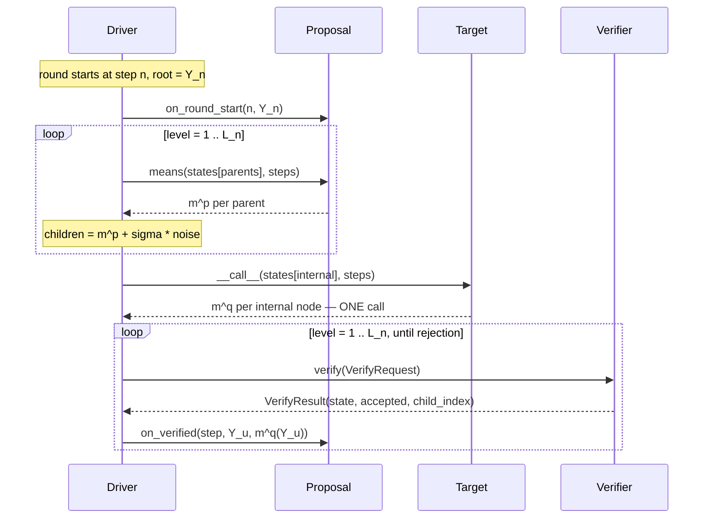

# Architecture

How the sampler is put together, and why the seams are where they are.

Read this if you are modifying the driver, adding a component type, or trying to work out
where a number in `result.summary()` came from. If you only want to write a verification
rule, [writing-a-verifier.md](writing-a-verifier.md) is the shorter path.

## Context

A standard diffusion sampler spends one neural function evaluation (NFE) per denoising
step: `N` steps, `N` calls to the expensive network. That is the cost the whole field is
trying to reduce, and the serial dependency is the reason it is hard — step `n + 1` needs
the output of step `n`.

Speculative sampling breaks the dependency the same way speculative decoding does in
language models. A cheap *proposal* drafts several steps ahead; the expensive *target* then
evaluates all the drafted states **in one batched call**; a *verification rule* decides how
long a prefix of that draft to keep. The draft is wrong sometimes, so the committed prefix
is short sometimes, but the trajectory's law is exactly preserved — that last part is the
entire point, and it is what the verification rule is responsible for.

The paper's framing is the design brief: its two rules (RMC and D-GRS) "differ only in the
two components the paper varies: the *draft topology* and the *verification rule*." So those
are the two things you supply, and the driver knows nothing about either.

## The components



The driver owns the loop and the bookkeeping and nothing else. It never learns whether the
target is a real denoiser or a closed-form mixture kernel, whether the tree is a chain or a
branching tree, or how the rule decides. That is what makes the paper's two algorithms drop
in as a local edit rather than a fork.

## Eq. (24): the one modelling assumption

Everything rests on a single assumption, which the request type encodes on purpose:

```
P_n(. | y) = N(m^p_n(y), sigma_n^2 I)     proposal
Q_n(. | y) = N(m^q_n(y), sigma_n^2 I)     target
```

Both kernels are isotropic Gaussians that **share the variance schedule** and differ only in
their means. `NoiseSchedule` is a single object handed to both, not one per model, so the
assumption is structural rather than a convention someone has to remember.

This is what makes the rank-1 reduction legal, and the rank-1 reduction is what turns a
`d`-dimensional coupling problem into a scalar one. See
[writing-a-verifier.md](writing-a-verifier.md#rank-1-coordinates).

`NoiseSchedule.__call__` refuses a zero or negative scale: at zero churn both kernels are
point masses, their total-variation distance is 1, and speculation is vacuous (Remark 3).

## One round, in three phases

A round starts at step `n` with the committed state `Y_n` at the root of the tree, and ends
having committed between 1 and `L_n` new states, where `L_n = min(L, N - n)`.


**Phase 1 is sequential in depth and parallel within a level.** A child cannot be drawn
before its parent exists, so the levels are ordered; but every node at a given level is
expanded in one proposal call. Every sibling is expanded, because which one survives is not
decided until Phase 3.

**Phase 2 is the round's only target call, and it covers internal nodes only.** Leaves are
never parents, so their target means are never needed — hence `|I| = B / K` for a uniform
tree (eq. 26). This single batched call is the round's whole NFE cost, and it is why the
method wins: `L` steps of progress for the price of one.

**Phase 3 descends and stops at the first rejection.** At each level the rule sees one
parent and its `K` drafted children, and returns a state that is an exact draw from
`N(m^q, sigma^2 I)`. If it accepted, the returned state *is* one of the children and the
walk descends into that child's subtree. If it rejected, the round ends there. Either way
one state is committed per level examined, so a round that rejects at level 1 still makes
one step of progress — which is why the loop always terminates.

### Step indexing

One convention, used identically in all three phases: **a node `u` at depth `d` within a
round starting at step `n` is associated with step `n + d`.** Its children realise step
`n + d + 1` and are drawn with scale `sigma_{n+d}`.

The deepest node the target is ever evaluated at has depth `L_n - 1`, so the largest step
index reaching the schedule is `n + L_n - 1 <= N - 1`. A `TabulatedSchedule` therefore needs
exactly `N` entries, never `N + 1`.

### Horizon truncation

Near the end of the trajectory a full-depth tree would overshoot. Eq. (27)'s truncation
`T|_m` handles it, and node ids are assigned breadth-first specifically so that the set of
nodes of depth `<= m` is a **prefix** `0 .. offset[m+1]` — truncation is a slice, not a
rebuild, and it is cached per instance since a run touches at most `L` distinct truncations.

The two drivers reach the same node set by different routes: the scalar one truncates the
tree, the batched one filters levels by each row's own lookahead. They agree, and
`tests/test_batched.py` pins that agreement at the level of bit-identical trajectories.

## Data flow through a round

Trajectory state lives in flat stacks of shape `(num_nodes, *state_shape)`, indexed by node
id. The batched driver uses the same layout with rows laid out as `row * tree.size + node`,
so the backend needs no gather beyond the row indexing it already has.



`on_verified` is the channel that makes **root-drift prefetching** work. The target mean at
the node just verified was paid for in Phase 2 and is the freshest drift in existence, so a
delayed-drift proposal caches it for the next round instead of spending an NFE. It fires
whether or not the child was accepted — the evaluation happened either way, and on a level-1
rejection it is the only drift the next round will have. Net effect: exactly one warm-up
target call for the whole run, at `n = 0`, and it is counted in `target_calls`.

## Cost accounting

`TargetTransition.__call__` — not `means` — keeps the counters, which is why subclasses
override `means` and callers invoke the instance:

| field | meaning |
| --- | --- |
| `target_calls` | batched calls to the target: **the NFE count the paper plots**, one per round plus proposal warm-up |
| `target_states_evaluated` | total rows pushed through the target — batch volume, not NFEs |
| `drafted_states` | states the proposal produced, `sum of B_n` |

`speedup = num_steps / target_calls`. The denominator includes any warm-up call a proposal
needed, so the number is honest rather than flattering: `standard_sampler` reports exactly
`1.00x`, and a rule that never accepts reports slightly *below* `1.00x` if its proposal
warmed up.

## The batched driver

Batching over images is orthogonal to the parallelism inside a round, and a real generation
job wants both. It is not a reshape, because speculation breaks the property that makes
image batching trivial: **trajectories accept different prefixes and immediately fall out of
step.** After one round, trajectory 0 may sit at step 4 and trajectory 1 at step 1.

Three consequences, and they are the whole design of `batched.py`:

1. **`sigma` becomes per row.** Rows of one verification batch belong to different steps, so
   `BatchedVerifyRequest` carries `sigmas`, a tuple.
2. **Live rows shrink as the round descends.** The driver *compacts* rather than masks: each
   level's request contains only rows still walking down their tree, so a rule never sees a
   dead row and never needs a validity flag.
3. **Cost is a max, not a mean.** One target call serves every live trajectory, so the batch
   advances at the pace of its slowest member. `speedup` (`N / iterations`) is strictly below
   `mean_isolated_speedup`, and the gap is the straggler cost you tune batch size against.

The batched path adds two requirements: the tree must be **level-uniform** (so a level's
candidates form a rectangular `(batch, K, *shape)` array), and the proposal must be a
`BatchedProposal`. Verification rules need no change — `verify_batch` defaults to a row-wise
loop over the `verify` you already wrote.

## Key decisions

**The tree is a first-class object.** "The chain is just `K = 1`" is only true if chain and
tree share a representation. They do: a `DraftTree` is a general rooted tree in BFS order,
`chain(L)` is a valid one, and depth-dependent widths (`from_widths`) or pruned trees need
no new code path. Appendix C's observation is what licenses this — the reverse chain is
Markov, so each drafted state is drawn conditionally on exactly one parent, so *any* draft
set is a rooted tree.

**`Verify` takes means and a scale, not distributions.** Eq. (24) is an assumption of the
template, not an implementation detail. Encoding it in the request type means a rule may
*rely* on it, which is what makes the rank-1 reduction legal.

**Topology constraints are checked at construction.** A rule that can only couple one
proposal sets `max_children = 1`, and the sampler refuses a branching tree at build time
rather than silently ignoring siblings at every node.

**One module touches the array framework.** `ops.py` is the entire dependency surface;
porting to JAX or MLX means one `Backend` subclass and no other edits. See
[models.md](models.md#adding-a-backend).

## Trade-offs and limits

**The single-trajectory sampler is not the fast path.** It exists to be readable and to be
the reference the batched driver is tested against. Real generation uses
`BatchedSpeculativeSampler`.

**Drafting cost is assumed negligible.** The paper's cost metric counts target calls only.
If your proposal is a distilled network rather than a frozen drift, `B` proposal
evaluations per round stop being free and `speedup` overstates the wall-clock win.
`drafted_states` is reported so you can price it yourself.

**Python-level index bookkeeping is the real hot spot at large batch.** `_draft` and
`_verify` build flat index lists per round, costing O(batch × tree.size) interpreter
operations. At batch 16k with `K=2, L=8` that dominates everything else, including the
array math. Memoising `NoiseSchedule.__call__` and hoisting the tree lookups out of the
comprehensions is where a real speedup lives; it has not been done.

**Exactness is not checkable at runtime.** A rule that returns a plausible-looking Gaussian
from the wrong distribution produces a run that finishes and reports a speedup. That is what
`check_exactness` is for, and why it belongs in the library rather than in each user's repo.
